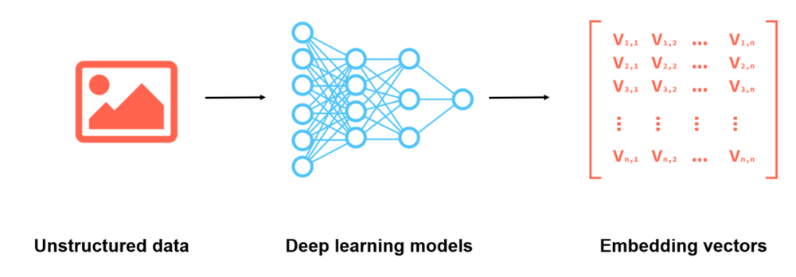
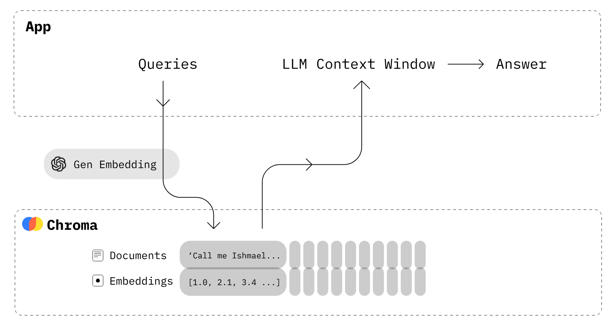

## How Does a Vector Database Work?

raditional databases store simple data like words and numbers in a table format. Vector databases, however, work with complex data called vectors and use unique methods for searching.

While regular databases search for exact data matches, vector databases look for the closest match using specific measures of similarity.

Vector databases use special search techniques known as Approximate Nearest Neighbor (ANN) search, which includes methods like hashing and graph-based searches.

Essentially, embeddings serve as a bridge, converting non-numeric data into a form that machine learning models can work with, enabling them to discern patterns and relationships in the data more effectively.

## Examples of Vector Database

### 5 of the Best Vector Databases in 2023

####  Chroma
> OPEN-SOURCE: ✅

> GITHUB STARS: 8K+⭐ 

Chroma is the open-source embedding database. Chroma makes it easy to build LLM apps by making knowledge, facts, and skills pluggable for LLMs. As we explore in our Chroma DB tutorial, you can easily manage text documents, convert text to embeddings, and do similarity searches.

#### Key Features:

- Feature-rich: queries, filtering, density estimates, and many other features
- LangChain (Python and JavScript), LlamaIndex, support available
- The same API that runs in Python notebook scales to the production cluster
