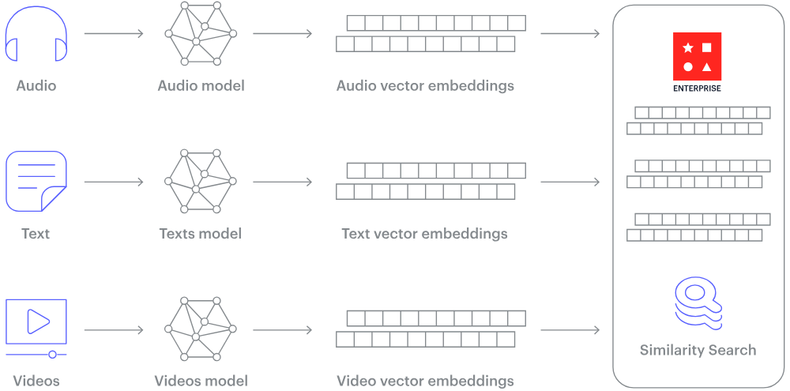
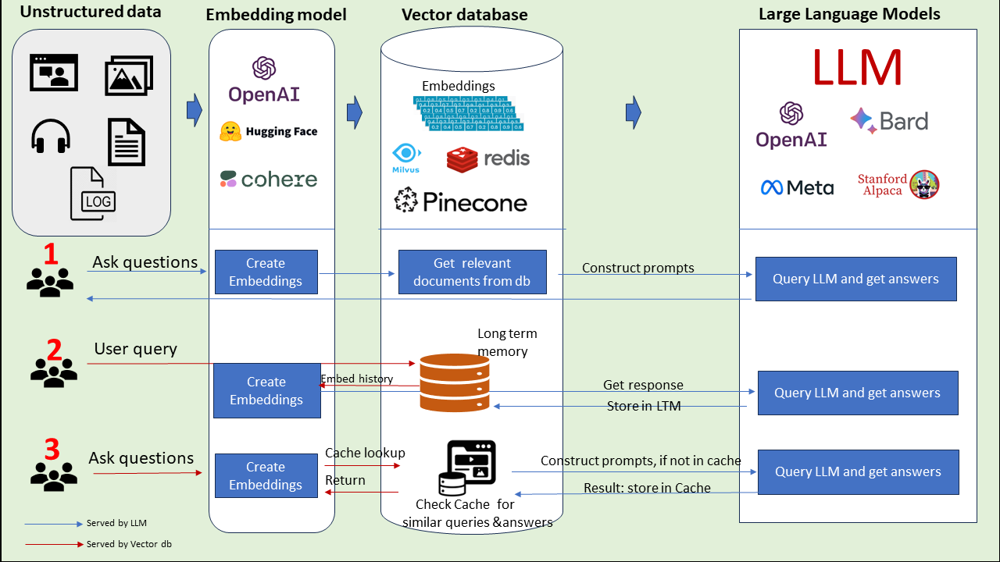

## How Does a Vector Database Work?

raditional databases store simple data like words and numbers in a table format. Vector databases, however, work with complex data called vectors and use unique methods for searching.

While regular databases search for exact data matches, vector databases look for the closest match using specific measures of similarity.

Vector databases use special search techniques known as Approximate Nearest Neighbor (ANN) search, which includes methods like hashing and graph-based searches.

Essentially, embeddings serve as a bridge, converting non-numeric data into a form that machine learning models can work with, enabling them to discern patterns and relationships in the data more effectively.

## Examples of Vector Database

### 5 of the Best Vector Databases in 2023

#### Chroma

> OPEN-SOURCE: ✅

> GITHUB STARS: 8K+⭐

Chroma is the open-source embedding database. Chroma makes it easy to build LLM apps by making knowledge, facts, and skills pluggable for LLMs. As we explore in our Chroma DB tutorial, you can easily manage text documents, convert text to embeddings, and do similarity searches.

#### Key Features:

- Feature-rich: queries, filtering, density estimates, and many other features
- LangChain (Python and JavScript), LlamaIndex, support available
- The same API that runs in Python notebook scales to the production cluster

#### Pinecone

> OPEN-SOURCE: ❎

> GITHUB STARS: N/A⭐
> Pinecone is a managed vector database platform that has been purpose-built to tackle the unique challenges associated with high-dimensional data. Equipped with cutting-edge indexing and search capabilities, Pinecone empowers data engineers and data scientists to construct and implement large-scale machine learning applications that effectively process and analyze high-dimensional data.

#### Weaviate

> OPEN-SOURCE: ✅

> GITHUB STARS: 7K+⭐
> Weaviate is an open-source vector database. It allows you to store data objects and vector embeddings from your favorite ML models and scale seamlessly into billions of data objects.
> 

### Faiss

> OPEN-SOURCE: ✅

> GITHUB STARS: 24K+⭐

Faiss is an open-source library for the swift search of similarities and the clustering of dense vectors. It houses algorithms capable of searching within vector sets of varying sizes, even those that might exceed RAM capacity. Additionally, Faiss offers auxiliary code for assessment and adjusting parameters.

While it's primarily coded in C++, it fully supports Python/NumPy integration. Some of its key algorithms are also available for GPU execution. The primary development of Faiss is undertaken by the Fundamental AI Research group at Meta.

#### Qdrant

> OPEN-SOURCE: ✅

> ITHUB STARS: 12.5K+⭐
> 

Qdrant is a vector database and a tool for conducting vector similarity searches. It operates as an API service, enabling searches for the closest high-dimensional vectors. Using Qdrant, you can transform embeddings or neural network encoders into comprehensive applications for tasks like matching, searching, making recommendations, and much more.
